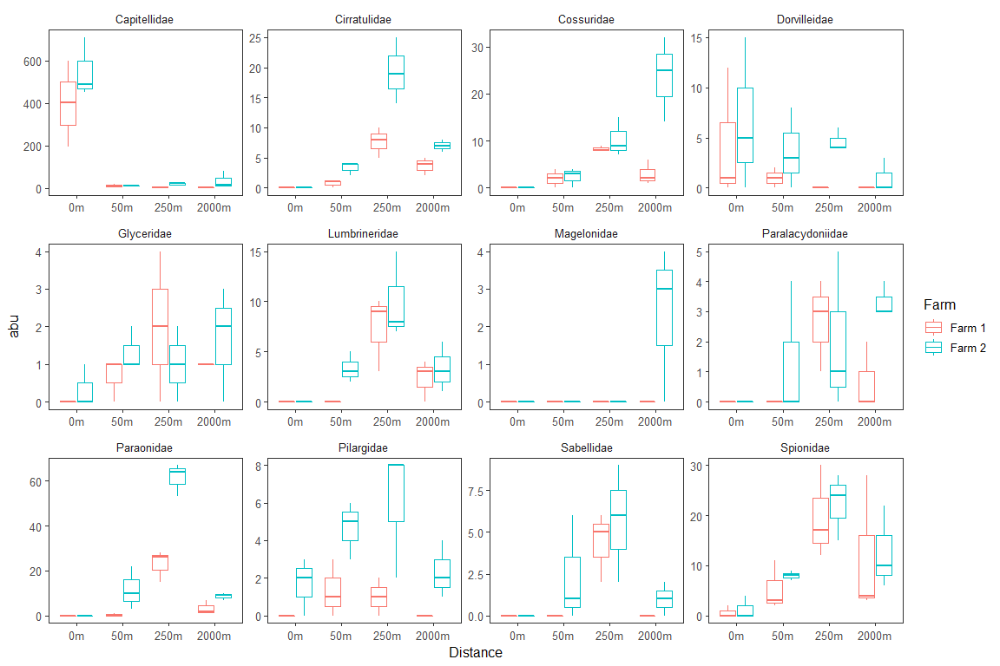
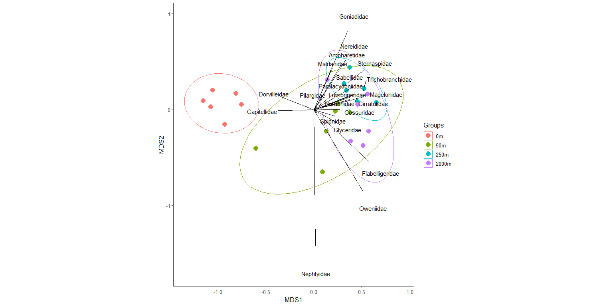
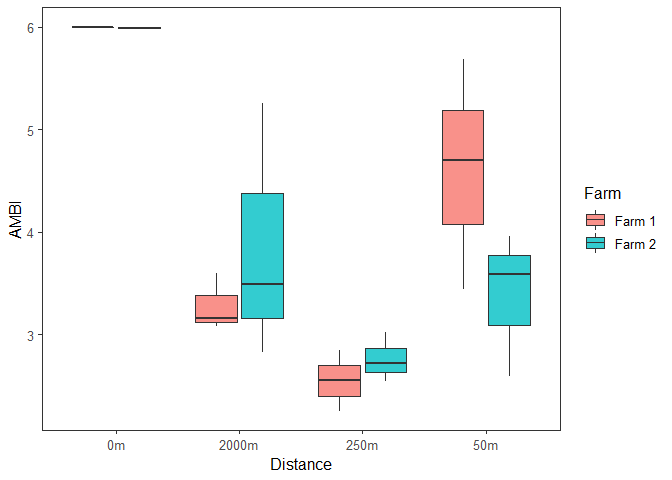
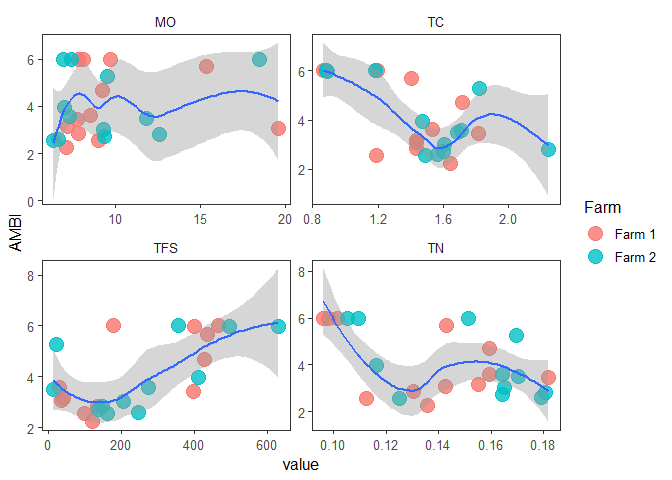
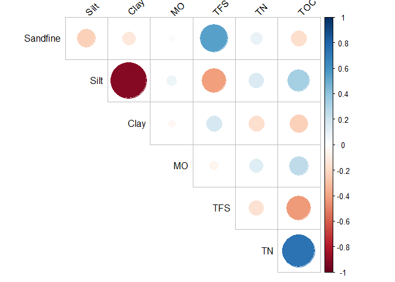
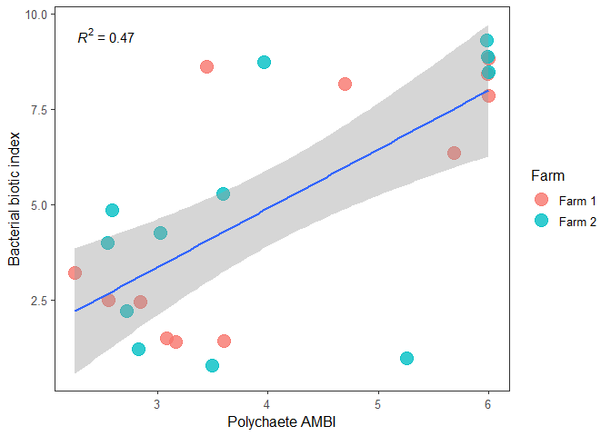

Analyses of benthic monitoring data of two Mediterranean fish farms
================

## 01 Load libraries and data

``` r
library(tidyverse)
library(ggpubr)
library(vegan)
library(ggord)
library(ggpmisc)
library(readxl)
library(knitr)
library(pairwiseAdonis)
library(benthos)
library(corrplot)

source('theme_javier.R')
theme_set(theme_javier())

# polychaetes data
poli <- 
  read_excel('data/poliquetos.xlsx', 2) %>% 
  mutate(Distance = fct_relevel(Distance, "0m" , "50m", "250m", "2000m"),
         Farm = fct_recode(Farm, `Farm 1` = "Ext", `Farm 2` = "Int"))

# sediment environmental data
env <- 
  read_excel('data/poliquetos.xlsx', 1) %>% 
  select(SampleID, TN, TC, MO, TFS)
```

## 02 Plot 12 most abundant families

``` r
poli_long <- 
  poli %>% 
  gather(taxa, abu, Capitellidae:Nephtyidae) 

top_taxa <- 
  poli_long %>% 
  group_by(taxa) %>% 
  summarise_at(vars(abu), funs(sum), na.rm =T) %>%
  top_n(12) %>% 
  dplyr::select(taxa) %>% 
  as.list()
```

    ## Warning: funs() is soft deprecated as of dplyr 0.8.0
    ## Please use a list of either functions or lambdas: 
    ## 
    ##   # Simple named list: 
    ##   list(mean = mean, median = median)
    ## 
    ##   # Auto named with `tibble::lst()`: 
    ##   tibble::lst(mean, median)
    ## 
    ##   # Using lambdas
    ##   list(~ mean(., trim = .2), ~ median(., na.rm = TRUE))
    ## This warning is displayed once per session.

    ## Selecting by abu

``` r
poli_long %>%
  filter(taxa %in% top_taxa$taxa) %>% 
  ggplot() +
  geom_boxplot(aes(Distance, abu, color = Farm)) +
  facet_wrap( ~ taxa, scales = 'free', nrow = 3)
```

<!-- -->

## 03 nMDS plot

``` r
# 04 MDS ordination -------------
mds <- metaMDS( sqrt(sqrt(poli[, -c(1:5)])) , distance = 'bray',)
```

    ## Run 0 stress 0.0804792 
    ## Run 1 stress 0.08114942 
    ## Run 2 stress 0.081816 
    ## Run 3 stress 0.0804778 
    ## ... New best solution
    ## ... Procrustes: rmse 0.0004476649  max resid 0.001567983 
    ## ... Similar to previous best
    ## Run 4 stress 0.08125616 
    ## Run 5 stress 0.0834672 
    ## Run 6 stress 0.1222901 
    ## Run 7 stress 0.08047834 
    ## ... Procrustes: rmse 0.0002869395  max resid 0.001014481 
    ## ... Similar to previous best
    ## Run 8 stress 0.1258553 
    ## Run 9 stress 0.08047781 
    ## ... Procrustes: rmse 5.691844e-05  max resid 0.0002011394 
    ## ... Similar to previous best
    ## Run 10 stress 0.0804263 
    ## ... New best solution
    ## ... Procrustes: rmse 0.006226734  max resid 0.02267717 
    ## Run 11 stress 0.081816 
    ## Run 12 stress 0.08181599 
    ## Run 13 stress 0.08223417 
    ## Run 14 stress 0.08181605 
    ## Run 15 stress 0.08223417 
    ## Run 16 stress 0.081816 
    ## Run 17 stress 0.08125617 
    ## Run 18 stress 0.08042559 
    ## ... New best solution
    ## ... Procrustes: rmse 0.000352893  max resid 0.001254337 
    ## ... Similar to previous best
    ## Run 19 stress 0.0834672 
    ## Run 20 stress 0.081816 
    ## *** Solution reached

``` r
## MDS biplot 
ggord(
  mds,
  grp_in = poli$Distance,
  poly = F,
  alpha = 1,
  ellipse = T,
  arrow = 0,
  repel = T,
  text = .01,
  vec_ext = .7
) +
  theme_javier()
```

<!-- -->

## 03 PERMANOVA and SIMPER

``` r
permanova <-
  adonis(
    sqrt(sqrt(poli[,-c(1:5)])) ~ Distance * Farm,
    method = 'bray',
    permutations = 9999,
    data = poli
  )

permanova
```

    ## 
    ## Call:
    ## adonis(formula = sqrt(sqrt(poli[, -c(1:5)])) ~ Distance * Farm,      data = poli, permutations = 9999, method = "bray") 
    ## 
    ## Permutation: free
    ## Number of permutations: 9999
    ## 
    ## Terms added sequentially (first to last)
    ## 
    ##               Df SumsOfSqs MeanSqs F.Model      R2 Pr(>F)    
    ## Distance       3    2.3760 0.79200 21.9170 0.71424 0.0001 ***
    ## Farm           1    0.1875 0.18745  5.1873 0.05635 0.0163 *  
    ## Distance:Farm  3    0.1850 0.06166  1.7063 0.05560 0.1517    
    ## Residuals     16    0.5782 0.03614         0.17381           
    ## Total         23    3.3266                 1.00000           
    ## ---
    ## Signif. codes:  0 '***' 0.001 '**' 0.01 '*' 0.05 '.' 0.1 ' ' 1

``` r
# pairwise comparisons-------------
pairwise.adonis(
  sqrt(sqrt(poli[,-c(1:5)])),
  poli$Distance)
```

    ##           pairs Df SumsOfSqs   F.Model        R2 p.value p.adjusted sig
    ## 1     0m vs 50m  1 0.9709690 17.913217 0.6417468   0.003      0.018   .
    ## 2    0m vs 250m  1 1.6477067 58.039808 0.8530272   0.002      0.012   .
    ## 3   0m vs 2000m  1 1.5316848 33.213406 0.7685903   0.004      0.024   .
    ## 4   50m vs 250m  1 0.2932122  5.990758 0.3746388   0.002      0.012   .
    ## 5  50m vs 2000m  1 0.1806801  2.710014 0.2132188   0.021      0.126    
    ## 6 250m vs 2000m  1 0.1277467  3.126717 0.2381949   0.026      0.156

``` r
# SIMPER ---------------
simp_distance <- simper(sqrt(sqrt(poli[, -c(1:5)])), poli$Distance, permutations = 999)
simp_Farm <- simper(sqrt(sqrt(poli[, -c(1:5)])), poli$Farm, permutations = 999)


simper_dist_table <- 
  bind_rows("0m vs. 50m" = simp_distance$`0m_50m` %>% data.frame(),
            "0m vs 250m" = simp_distance$`0m_250m` %>% data.frame(),
            "0m vs 2000m" = simp_distance$`0m_2000m` %>% data.frame(),
          "50m vs 250m" = simp_distance$`50m_250m` %>% data.frame(),
          "50m vs. 2000m" = simp_distance$`50m_2000m` %>% data.frame(),
          "250m vs 2000m" = simp_distance$`250m_2000m` %>% data.frame(),
            .id = "Groups") %>% 
  dplyr::select(-overall, -ord) %>% 
  dplyr::filter(cusum<.7) %>% 
  rename(Family = "species")
  
kable(simper_dist_table, digits = 2,caption = "SIMPER table among distances")
```

| Groups        | Family        | average |   sd | ratio |  ava |  avb | cusum |    p |
| :------------ | :------------ | ------: | ---: | ----: | ---: | ---: | ----: | ---: |
| 0m vs. 50m    | Capitellidae  |    0.17 | 0.04 |  4.04 | 4.60 | 1.73 |  0.28 | 0.00 |
| 0m vs. 50m    | Spionidae     |    0.07 | 0.04 |  1.72 | 0.43 | 1.56 |  0.39 | 0.00 |
| 0m vs. 50m    | Paraonidae    |    0.05 | 0.04 |  1.31 | 0.00 | 1.04 |  0.48 | 0.22 |
| 0m vs. 50m    | Dorvilleidae  |    0.05 | 0.04 |  1.31 | 1.05 | 0.86 |  0.56 | 0.03 |
| 0m vs. 50m    | Cossuridae    |    0.05 | 0.04 |  1.30 | 0.00 | 0.89 |  0.64 | 0.07 |
| 0m vs 250m    | Capitellidae  |    0.12 | 0.03 |  3.51 | 4.60 | 1.71 |  0.16 | 0.01 |
| 0m vs 250m    | Spionidae     |    0.07 | 0.03 |  2.37 | 0.43 | 2.12 |  0.29 | 0.00 |
| 0m vs 250m    | Paraonidae    |    0.10 | 0.01 | 10.71 | 0.00 | 2.49 |  0.38 | 0.00 |
| 0m vs 250m    | Dorvilleidae  |    0.04 | 0.03 |  1.20 | 1.05 | 0.73 |  0.48 | 0.55 |
| 0m vs 250m    | Cossuridae    |    0.07 | 0.01 |  8.28 | 0.00 | 1.74 |  0.57 | 0.00 |
| 0m vs 250m    | Cirratulidae  |    0.08 | 0.01 | 10.42 | 0.00 | 1.87 |  0.66 | 0.00 |
| 0m vs 2000m   | Capitellidae  |    0.15 | 0.06 |  2.50 | 4.60 | 1.65 |  0.20 | 0.00 |
| 0m vs 2000m   | Spionidae     |    0.07 | 0.04 |  1.70 | 0.43 | 1.76 |  0.31 | 0.00 |
| 0m vs 2000m   | Paraonidae    |    0.07 | 0.01 |  6.06 | 0.00 | 1.49 |  0.41 | 0.00 |
| 0m vs 2000m   | Dorvilleidae  |    0.05 | 0.04 |  1.23 | 1.05 | 0.22 |  0.51 | 0.04 |
| 0m vs 2000m   | Cossuridae    |    0.08 | 0.02 |  5.12 | 0.00 | 1.72 |  0.60 | 0.00 |
| 0m vs 2000m   | Cirratulidae  |    0.07 | 0.01 |  6.61 | 0.00 | 1.50 |  0.67 | 0.00 |
| 50m vs 250m   | Capitellidae  |    0.01 | 0.01 |  1.26 | 1.73 | 1.71 |  0.14 | 1.00 |
| 50m vs 250m   | Spionidae     |    0.02 | 0.01 |  1.59 | 1.56 | 2.12 |  0.24 | 0.97 |
| 50m vs 250m   | Paraonidae    |    0.05 | 0.04 |  1.47 | 1.04 | 2.49 |  0.34 | 0.21 |
| 50m vs 250m   | Dorvilleidae  |    0.03 | 0.02 |  1.23 | 0.86 | 0.73 |  0.43 | 0.96 |
| 50m vs 250m   | Cossuridae    |    0.03 | 0.03 |  1.19 | 0.89 | 1.74 |  0.51 | 0.97 |
| 50m vs 250m   | Cirratulidae  |    0.03 | 0.02 |  1.34 | 1.00 | 1.87 |  0.59 | 0.89 |
| 50m vs 250m   | Lumbrineridae |    0.04 | 0.03 |  1.35 | 0.67 | 1.68 |  0.66 | 0.21 |
| 50m vs. 2000m | Capitellidae  |    0.03 | 0.02 |  1.40 | 1.73 | 1.65 |  0.10 | 0.99 |
| 50m vs. 2000m | Spionidae     |    0.02 | 0.01 |  1.17 | 1.56 | 1.76 |  0.19 | 0.98 |
| 50m vs. 2000m | Paraonidae    |    0.04 | 0.03 |  1.21 | 1.04 | 1.49 |  0.28 | 0.98 |
| 50m vs. 2000m | Dorvilleidae  |    0.03 | 0.03 |  1.26 | 0.86 | 0.22 |  0.37 | 0.67 |
| 50m vs. 2000m | Cossuridae    |    0.04 | 0.03 |  1.28 | 0.89 | 1.72 |  0.46 | 0.65 |
| 50m vs. 2000m | Cirratulidae  |    0.02 | 0.03 |  0.90 | 1.00 | 1.50 |  0.54 | 0.97 |
| 50m vs. 2000m | Lumbrineridae |    0.03 | 0.03 |  1.07 | 0.67 | 1.10 |  0.61 | 0.74 |
| 50m vs. 2000m | Glyceridae    |    0.02 | 0.02 |  0.74 | 0.86 | 0.92 |  0.67 | 0.98 |
| 250m vs 2000m | Capitellidae  |    0.02 | 0.01 |  1.45 | 1.71 | 1.65 |  0.11 | 1.00 |
| 250m vs 2000m | Spionidae     |    0.02 | 0.01 |  1.43 | 2.12 | 1.76 |  0.21 | 0.99 |
| 250m vs 2000m | Paraonidae    |    0.03 | 0.02 |  2.02 | 2.49 | 1.49 |  0.29 | 1.00 |
| 250m vs 2000m | Dorvilleidae  |    0.02 | 0.02 |  0.99 | 0.73 | 0.22 |  0.36 | 1.00 |
| 250m vs 2000m | Cossuridae    |    0.01 | 0.01 |  1.87 | 1.74 | 1.72 |  0.42 | 1.00 |
| 250m vs 2000m | Cirratulidae  |    0.01 | 0.01 |  1.41 | 1.87 | 1.50 |  0.48 | 1.00 |
| 250m vs 2000m | Lumbrineridae |    0.02 | 0.02 |  1.04 | 1.68 | 1.10 |  0.54 | 1.00 |
| 250m vs 2000m | Glyceridae    |    0.02 | 0.02 |  1.09 | 0.80 | 0.92 |  0.60 | 0.98 |
| 250m vs 2000m | Pilargidae    |    0.03 | 0.02 |  1.25 | 1.12 | 0.60 |  0.65 | 0.96 |

SIMPER table among distances

## 04 PERMDIST Multivariate homogeneity of groups dispersions

``` r
dis <- vegdist(sqrt(sqrt(poli[, -c(1:5)])))
beta_disp <-
  betadisper(
    dis, poli$Distance
  )
```

    ## Warning in betadisper(dis, poli$Distance): some squared distances are negative
    ## and changed to zero

``` r
beta_disp
```

    ## 
    ##  Homogeneity of multivariate dispersions
    ## 
    ## Call: betadisper(d = dis, group = poli$Distance)
    ## 
    ## No. of Positive Eigenvalues: 13
    ## No. of Negative Eigenvalues: 10
    ## 
    ## Average distance to median:
    ##     0m    50m   250m  2000m 
    ## 0.1598 0.2135 0.1334 0.2161 
    ## 
    ## Eigenvalues for PCoA axes:
    ## (Showing 8 of 23 eigenvalues)
    ##   PCoA1   PCoA2   PCoA3   PCoA4   PCoA5   PCoA6   PCoA7   PCoA8 
    ## 2.31922 0.47072 0.31873 0.15357 0.11520 0.09259 0.06986 0.05349

``` r
anova(beta_disp)
```

    ## Analysis of Variance Table
    ## 
    ## Response: Distances
    ##           Df   Sum Sq   Mean Sq F value Pr(>F)
    ## Groups     3 0.030015 0.0100051  1.1843 0.3408
    ## Residuals 20 0.168968 0.0084484

``` r
permutest(beta_disp, pairwise = TRUE, permutations = 999)
```

    ## 
    ## Permutation test for homogeneity of multivariate dispersions
    ## Permutation: free
    ## Number of permutations: 999
    ## 
    ## Response: Distances
    ##           Df   Sum Sq   Mean Sq      F N.Perm Pr(>F)
    ## Groups     3 0.030015 0.0100051 1.1843    999   0.38
    ## Residuals 20 0.168968 0.0084484                     
    ## 
    ## Pairwise comparisons:
    ## (Observed p-value below diagonal, permuted p-value above diagonal)
    ##             0m      50m     250m 2000m
    ## 0m             0.466000 0.396000 0.115
    ## 50m   0.457807          0.310000 0.972
    ## 250m  0.369678 0.267179          0.013
    ## 2000m 0.103298 0.971048 0.014834

``` r
plot(beta_disp, main = 'Multivariate homogeneity of groups dispersions')
```

<!-- -->

## 05 Univariate diversity indices

``` r
indices <- 
  poli %>% 
  transmute(N = rowSums(poli[, -c(1:5)]),
            H = diversity(poli[, -c(1:5)]),
            S = specnumber(poli[, -c(1:5)]),
            J = H/log(S)) %>% 
  bind_cols(poli[, c(1:5)]) %>% 
  write_csv('outputs/univariate_poli_indices.csv')

boxplots <- 
  indices %>% 
  gather(index, value, c("N", "S", "H", "J")) %>% 
  mutate(index = fct_relevel(index, c("N", "S", "J"))) %>% 
  ggplot(., aes(x = Distance, y = value, fill = Farm)) +
  geom_boxplot(alpha = .8) +
  facet_wrap(~index,scales = 'free') +
  theme_bw()

boxplots
```

    ## Warning: Removed 1 rows containing non-finite values (stat_boxplot).

<!-- -->

``` r
indices_dat <-
  indices %>%
  mutate(N = log(N + 1)) %>% 
  gather(index, value, c("N", "S", "H", "J")) %>%
  group_by(index) %>%
  nest() %>%
  mutate(
    anova = map(.x = data, ~ aov(value ~ Distance * Farm, data = .x)),
    anova_tab = map(anova, ~car::Anova(.)),
    anova_table = map(anova_tab, broom::tidy),
    residuals = map(anova, broom::augment))

anova_table <- 
  indices_dat %>% 
  select(index,anova_table) %>% 
  unnest()
```

    ## Warning: `cols` is now required.
    ## Please use `cols = c(anova_table)`

``` r
kable(anova_table,caption = 'Univariate ANOVAs')
```

| index | term          |       sumsq | df |  statistic |   p.value |
| :---- | :------------ | ----------: | -: | ---------: | --------: |
| N     | Distance      |  23.4024283 |  3 | 60.2330129 | 0.0000000 |
| N     | Farm          |   3.8537146 |  1 | 29.7559946 | 0.0000529 |
| N     | Distance:Farm |   0.6126238 |  3 |  1.5767670 | 0.2339831 |
| N     | Residuals     |   2.0721685 | 16 |         NA |        NA |
| S     | Distance      | 268.3333333 |  3 | 65.0505051 | 0.0000000 |
| S     | Farm          |  42.6666667 |  1 | 31.0303030 | 0.0000422 |
| S     | Distance:Farm |   6.3333333 |  3 |  1.5353535 | 0.2438255 |
| S     | Residuals     |  22.0000000 | 16 |         NA |        NA |
| H     | Distance      |  13.6232937 |  3 | 70.7468043 | 0.0000000 |
| H     | Farm          |   0.3450180 |  1 |  5.3751139 | 0.0339899 |
| H     | Distance:Farm |   0.5436682 |  3 |  2.8233106 | 0.0719844 |
| H     | Residuals     |   1.0270085 | 16 |         NA |        NA |
| J     | Distance      |   1.9539446 |  3 | 62.0474568 | 0.0000000 |
| J     | Farm          |   0.0020967 |  1 |  0.1997415 | 0.6613150 |
| J     | Distance:Farm |   0.0719965 |  3 |  2.2862456 | 0.1204108 |
| J     | Residuals     |   0.1574557 | 15 |         NA |        NA |

Univariate ANOVAs

## 06 Polychaete AMBI

``` r
poli_long %>% 
  mutate(COMPLIANT = is_accepted(taxon = taxa)) %>% 
  group_by(taxa) %>% 
  distinct(COMPLIANT) %>% 
  filter(COMPLIANT==FALSE) # two non-compliant taxa
```

    ## # A tibble: 2 x 2
    ## # Groups:   taxa [2]
    ##   COMPLIANT taxa            
    ##   <lgl>     <chr>           
    ## 1 FALSE     Paralacydoniidae
    ## 2 FALSE     Sternaspidae

``` r
AMBI_poli <- 
  poli_long %>%
  group_by(SampleID) %>% 
  nest() %>% 
  mutate(AMBI = map(data, ~ ambi(taxon = .x$taxa, count = .x$abu))) %>% 
  select(SampleID,AMBI) %>% 
  unnest() %>% 
  right_join(indices, by = "SampleID")
```

    ## Warning: `data_frame()` is deprecated as of tibble 1.1.0.
    ## Please use `tibble()` instead.
    ## This warning is displayed once every 8 hours.
    ## Call `lifecycle::last_warnings()` to see where this warning was generated.

    ## Warning: `cols` is now required.
    ## Please use `cols = c(AMBI)`

``` r
ggplot(AMBI_poli, aes(x = Distance, y = AMBI, fill = Farm)) +
  geom_boxplot(alpha = .8)
```

<!-- -->

``` r
AMBI_env <- left_join(AMBI_poli, env, by = "SampleID")

# AMBI enviroment relationships ------------
AMBI_env %>% 
  gather(key, value, TN:TFS) %>% 
ggplot(aes(x = value, y = AMBI)) +
  geom_point(alpha = .8, aes(color = Farm), size = 5) +
  geom_smooth() +
  facet_wrap(~key, scales = 'free')
```

    ## `geom_smooth()` using method = 'loess' and formula 'y ~ x'

<!-- -->

## 07 Correlation among env. variables

``` r
env_bact <- read_csv('data/env_bact.csv', col_types = cols())

cors <- 
  env_bact %>%
  select(Sandfine:TOC) %>%
  cor(method = "pearson")


corrplot(
  cors,
  type = "upper",
  tl.col = "black",
  tl.srt = 45,
  diag = F,
  method = 'circle')
```

<!-- -->

## 08 Bacterial biotic index

``` r
bact_ambi <- read_csv('data/bMBI_data.csv', col_types = cols())
env_bact <- read_csv('data/env_bact.csv', col_types = cols())
bact_env_ambi <- full_join(bact_ambi, env_bact, by = "SampleID")

bact_env_ambi %>%
gather(key, value, Sandfine:TOC) %>%
ggplot(aes(x = value, y = AMBI_bact)) +
geom_point(alpha = .8, size = 5, aes(color = Farm)) +
geom_smooth(method = 'lm') +
stat_poly_eq(
formula = y ~ x,
aes(label = ..rr.label..),
parse = TRUE,
size = 4
) +
labs(y = "Bacterial biotic index") +
facet_wrap( ~ key, scales = 'free_x')
```

    ## `geom_smooth()` using formula 'y ~ x'

<!-- -->

## 09 Relationship between bacterial AMBI and polyquete AMBI

``` r
bact_poli_ambi <- left_join(AMBI_poli, bact_ambi, by = "SampleID")

ggplot(bact_poli_ambi, aes(x = AMBI, y = AMBI_bact)) +
  geom_point(alpha = .8, size = 5, aes(color = Farm)) +
  geom_smooth(method = 'lm') +
  stat_poly_eq(
    formula = y ~ x,
    aes(label = ..rr.label..),
    parse = TRUE,
    size = 4
  ) +
  labs(x = "Polychaete AMBI" , y = "Bacterial biotic index")
```

    ## `geom_smooth()` using formula 'y ~ x'

<!-- -->

The sample “Int\_2000m\_1\_c” seems to be an outlier affecting the AMBI
relationship, as it has an abundance of 82 Capetilidae at 2000 m
Distance. If this point is removed the relationship improves quite a
bit.

``` r
bact_poli_ambi %>% 
  filter(SampleID !="Int_2000m_1_c") %>%
ggplot(aes(x = AMBI, y = AMBI_bact)) +
  geom_point(alpha = .8, size = 5, aes(color = Farm)) +
  geom_smooth(method = 'lm') +
  stat_poly_eq(
    formula = y ~ x,
    aes(label = ..rr.label..),
    parse = TRUE,
    size = 4
  ) +
  labs(x = "Polychaete AMBI" , y = "Bacterial biotic index")
```

    ## `geom_smooth()` using formula 'y ~ x'

<!-- -->
